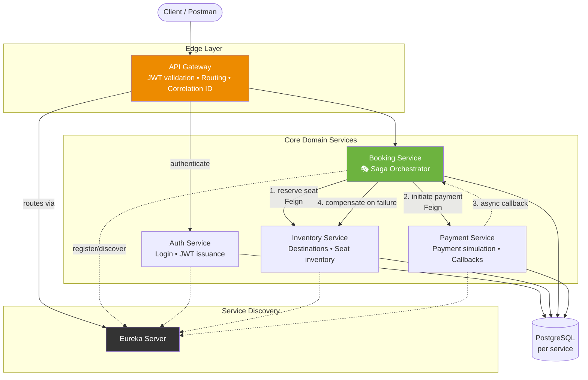
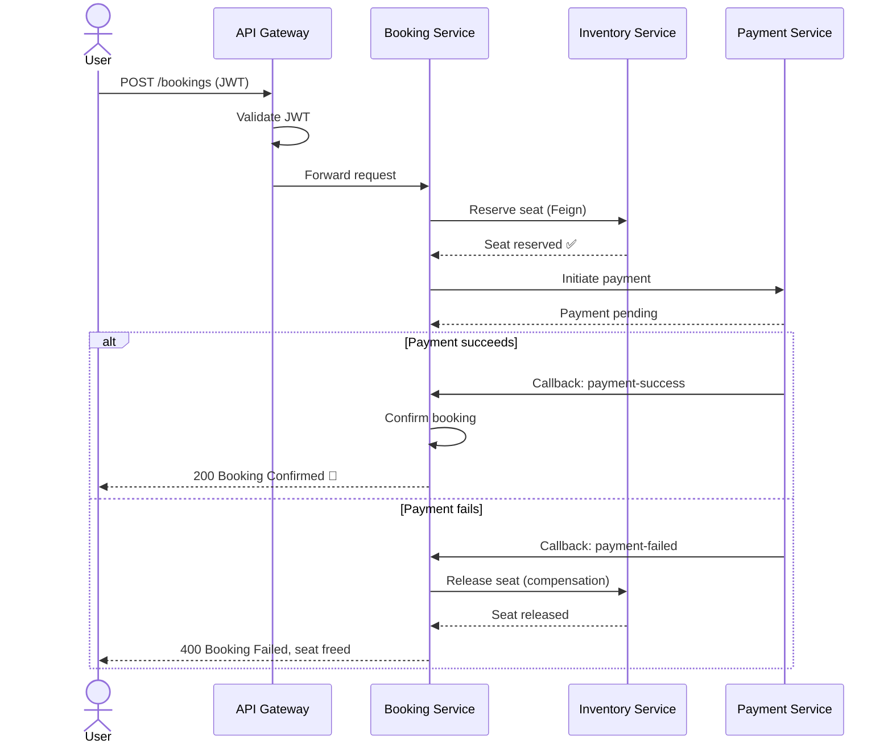

<div align="center">

# ✈️ TripVerse
### A Production-Grade Microservices Travel Booking Platform

*Distributed systems, done the way real banking-grade backends are built.*

[](https://openjdk.org/)
[](https://spring.io/projects/spring-boot)
[](https://spring.io/projects/spring-cloud)
[](https://www.postgresql.org/)
[](https://jwt.io/)
[](https://maven.apache.org/)

[Architecture](#-system-architecture) •
[Services](#-microservices-breakdown) •
[Booking Flow](#-the-booking-saga-in-action) •
[Run Locally](#-getting-started) •
[Roadmap](#-roadmap)

</div>

---

## 🧭 Why TripVerse Exists

Most portfolio projects are CRUD apps with a login page bolted on. **TripVerse isn't that.**

It's a simulation of the hardest part of backend engineering: what happens when a single business action — *booking a trip* — has to succeed or fail **atomically across five independent services that don't share a database.**

Built around a real-world scenario inspired by platforms like MakeMyTrip, TripVerse exists to answer one question I kept getting asked in interviews:

> *"Have you actually built something with distributed transactions, or just read about the Saga pattern?"*

This is my answer.

---

## 🏗️ System Architecture



**Design principles enforced throughout:**
- 🔐 **Stateless security** — JWT validated once at the Gateway, propagated via internal service tokens
- 🧩 **Zero shared database** — every service owns its data; no service reaches into another's tables
- 🎭 **Orchestration over choreography** — Booking Service explicitly drives the transaction instead of relying on implicit event chains, so the failure path is always traceable
- 🔁 **Idempotent APIs** — safe retries on network blips, a non-negotiable in payment flows

---

## 🔍 Microservices Breakdown

| Service | Responsibility | Talks To |
|---|---|---|
| 🧭 **Eureka Server** | Central service registry & discovery | All services |
| 🚪 **API Gateway** | Routing, JWT auth, correlation-ID injection | Auth, Booking |
| 🔑 **Auth Service** | User authentication & JWT issuance | — |
| 📦 **Inventory Service** | Destination catalog & seat availability | Booking |
| 🎭 **Booking Service** | **Saga orchestrator** — drives the entire booking lifecycle | Inventory, Payment |
| 💳 **Payment Service** | Payment simulation & async callbacks | Booking |

---

## 🎭 The Booking Saga in Action

This is the centerpiece of the project — a real orchestration-based Saga with a **compensating transaction** on failure.



> 💡 **Why this matters:** In a monolith, this is one `@Transactional` annotation. Across five independently-deployable services with separate databases, there's no distributed rollback to lean on — the compensating action (releasing the seat) has to be **explicitly coded and idempotent**. That's the actual engineering problem the Saga pattern solves, and it's implemented end-to-end here.

---

## 🛠️ Tech Stack

<table>
<tr>
<td valign="top" width="33%">

**Core**
- Java 17
- Spring Boot 3
- Maven

</td>
<td valign="top" width="33%">

**Distributed Systems**
- Spring Cloud Gateway
- Netflix Eureka
- OpenFeign

</td>
<td valign="top" width="33%">

**Security & Data**
- JWT Authentication
- PostgreSQL
- Internal service tokens

</td>
</tr>
</table>

---

## 📡 Sample API Flow

```http
### 1. Authenticate
POST /auth/login
Content-Type: application/json

{ "username": "traveler01", "password": "••••••" }

### 2. Browse inventory
POST /inventory/destinations
Authorization: Bearer <JWT>

### 3. Create a booking (triggers the Saga)
POST /bookings
Authorization: Bearer <JWT>

### 4. Payment gateway callback (internal)
POST /internal/bookings/{ref}/payment-success
```

---

## 🚀 Getting Started

### Prerequisites
`Java 17` · `Maven` · `PostgreSQL` · `Git`

### Run the services — order matters (service discovery bootstraps first)

```bash
# 1. Clone
git clone https://github.com/Ashu-del/TripVerse.git
cd TripVerse

# 2. Start in this exact order
cd discovery-server && mvn spring-boot:run      # 1️⃣ Eureka Server
cd auth-service      && mvn spring-boot:run     # 2️⃣ Auth Service
cd inventory-service  && mvn spring-boot:run    # 3️⃣ Inventory Service
cd payment-service    && mvn spring-boot:run    # 4️⃣ Payment Service
cd booking-service    && mvn spring-boot:run    # 5️⃣ Booking Service (orchestrator)
cd api-gateway         && mvn spring-boot:run   # 6️⃣ API Gateway
```

Once all six services register with Eureka, hit the Gateway on its configured port and follow the [Sample API Flow](#-sample-api-flow) above.

---

## 📂 Project Structure

```
TripVerse/
├── discovery-server/     # Eureka service registry
├── api-gateway/          # Routing + JWT validation + correlation IDs
├── auth-service/         # Authentication & JWT issuance
├── inventory-service/    # Destinations & seat management
├── booking-service/      # 🎭 Saga orchestrator — the heart of the system
└── payment-service/      # Payment simulation & callbacks
```

---

## 🧠 Key Design Concepts Demonstrated

| Concept | Where It Lives |
|---|---|
| API Gateway Pattern | `api-gateway/` |
| Saga Pattern (Orchestration-based) | `booking-service/` |
| Service Discovery | `discovery-server/` + Eureka clients |
| Idempotent APIs | Payment callback handlers |
| Compensating Transactions | Booking failure → seat release |
| Public vs. Internal API separation | Gateway routing rules |

---

## 🗺️ Roadmap

- [ ] Docker & Docker Compose for one-command spin-up
- [ ] Circuit breakers via Resilience4j on inter-service calls
- [ ] Centralized logging (ELK / correlation-ID tracing)
- [ ] Notification Service (email/SMS on booking confirmation)
- [ ] Kubernetes deployment manifests

---

## 👤 Author

**Ashutosh Pandey**
Backend Developer · Java · Spring Boot · Microservices

Building distributed systems that mirror real production banking and travel platforms — not tutorial-grade demos.

[](https://github.com/Ashu-del)

---

<div align="center">

*If this project helped you understand the Saga pattern or distributed booking flows, consider ⭐ starring the repo.*

</div>
